# GN-SHOP

**GN-SHOP: A comprehensive e-commerce platform for a seamless shopping experience.**


- [Live Site](https://gn-shop-e18f4dd2529c.herokuapp.com/)
- [GitHub Repo](https://github.com/wlia-code/ServeShop)

## Table of Contents
- [Project Description](#project-description)
- [UX](#ux)
  - [Goals](#goals)
  - [Target Audience](#target-audience)
  - [User Stories](#user-stories)
- [Features](#features)
  - [Existing Features](#existing-features)
  - [Features Left to Implement](#features-left-to-implement)
- [E-commerce Business Model](#e-commerce-business-model)
- [Facebook Business Page](#facebook-business-page)
- [Newsletter Signup](#newsletter-signup)
- [SEO Strategy](#seo-strategy)
- [Visual Overview](#visual-overview)
- [Entity Relationship Diagram (ERD)](#Entity-Relationship-Diagram-(ERD))
  - [Database Choice](#database-choice)
  - [Data Models](#data-models)
- [Technologies Used](#technologies-used)
- [Testing](#testing)
- [Installation & Usage](#installation--usage)
- [Deployment](#deployment)
- [Credits](#credits)

## Project Description

**GN-SHOP** is an advanced e-commerce platform designed to provide users with an extensive range of products from various categories such as electronics, fashion, home essentials, and more. This platform facilitates a user-friendly shopping experience with advanced functionalities like product reviews, wishlists, and comprehensive order management.

## UX

### Goals

The primary goal of the GN-SHOP project is to demonstrate a robust and fully-functional online shopping platform built with Django. It showcases seamless integration of product listings, user authentication, and advanced features like wishlists and testimonials.

### Target Audience

- B2C (Business to Consumer) model,  the target audience is individual consumers who are looking for a convenient and varied     
  shopping experience from the comfort of their own homes or on the go. The platform is specifically designed to cater to the needs and preferences of end-users rather than businesses or wholesale buyers, focusing on direct sales through an accessible online store interface. This approach makes the platform suitable for a wide range of consumers, from casual shoppers to those seeking specific items for personal use.


### User Stories

Here are the user stories that guided the development of GN-SHOP:


- **Account Management**: Users can register, manage their profiles, and securely login or logout. 
- **Shopping Experience**: Users can browse products, add items to their shopping cart, adjust quantities, and sort or search for specific products easily.
- **Product Interaction**: After purchase, users can leave reviews, enhancing the community-driven shopping experience.
- **Order Handling**: Shoppers can view their past orders and track current orders with ease.
- **Customer Engagement**: Users can contact GN-SHOP through a dedicated form, subscribe to newsletters for updates, and submit testimonials.
- **Administrative Functions**: Admins can manage products, orders, and user reviews, ensuring the site remains up-to-date and accurate.

- [Click to see the full version of User Stories On github](https://github.com/users/wlia-code/projects/5)

- 

[Back to Top](#Table-of-Contents)

## Features


### Existing Features

- **Product Management** *(adapted from Code Institute's Boutique Ado)*: Allows admins to add, edit, or delete products.
- **User Authentication System** *(adapted from Code Institute's Boutique Ado)*: Supports user registration, login, logout, and profile management.
- **Order Management**: Enables users to view and manage their past orders and order details.
- **Search Functionality** *(adapted from Code Institute's Boutique Ado)*: Features a search bar for finding products by name or description.
- **User Profile**: Manage and update personal information and settings 
- **My Orders**: Users can track their order history and manage their purchases
- **Contact Us Form**: Provides a simple interface for users to submit inquiries or feedback, enhancing communication and user engagement.
- **Newsletter Signup**: Integrated in the footer on every page, this feature uses Mailchimp to manage subscriptions, offering promotions and updates via email.
- **Testimonials**: Allows customers to share their experiences, helping others make informed decisions. This feature is accessible only after a customer has logged in
- **Product Reviews**: Post-purchase, customers can leave product ratings and reviews, aiding others in their shopping decisions and providing the shop with valuable feedback.
-**add to Wishlist**: Users can save products to a wishlist for later purchase.
### Testimonials and Reviews
- **Testimonials**: Allows customers to share their experiences on the GN-SHOP platform. Testimonials require user login for submission and undergo an approval process by the admin. Once approved, they are displayed on the homepage to assist other customers in making informed decisions

- **Product Reviews**: After purchasing, customers can leave reviews on the products they've bought. These reviews include ratings and text feedback, which are visible on the product detail pages once approved by an administrator. This process ensures that all feedback is genuine and helpful to others

### Admin Panel Features
- **Comprehensive Management Tools**: The admin panel of GN-SHOP is equipped with extensive CRUD capabilities, allowing admins to manage the entire lifecycle of products, testimonials, and reviews effectively. This includes the ability to:
  - **Create**: Add new products or testimonials as needed.
  - **Read**: View all entries and data submitted by users.
  - **Update**: Modify existing product details or approve testimonials and reviews to ensure they meet community standards.
  - **Delete**: Remove outdated or inappropriate content to maintain the site’s integrity and relevance

### Features Left to Implement

- **Live Chat Support**: Integrate a live chat feature to provide real-time assistance, enhancing customer service capabilities.

- **Multi-Language Support**: Expand market reach by offering the website in multiple languages.

- **Loyalty Program**: Implement a loyalty program to reward repeat customers with discounts and special offers.

- **Gift Card System**: Allow customers to purchase and redeem gift cards, increasing purchasing flexibility.

- **Advanced Analytics for Users**: Provide detailed analytics on user spending habits and preferences through a personalized dashboard.

- **Augmented Reality**: Use AR technology to allow customers to visualize products in their environment before purchasing.

- **Customizable Products**: Enable product customization options such as color choices or personalizations.

- **Social Media Integration**: Facilitate social media logins and enable sharing of products and purchases.

- **Mobile App**: Develop a dedicated mobile app to improve the shopping experience on smartphones and tablets.

- **Product Recommendations**: Suggest products to users based on their browsing history.

[Back to Top](#Table-of-Contents)


## E-commerce Business Model


GN-SHOP operates on a direct-to-consumer (DTC) e-commerce business model, where we provide a wide range of products directly to customers through our online platform. Our business model focuses on:

1. **Product Diversity**: Offering a broad selection of items across various categories such as electronics, fashion, and home essentials.
2. **Customer Experience**: Ensuring a seamless shopping experience with user-friendly navigation, secure payment options, and efficient customer service.
3. **Competitive Pricing**: Providing high-quality products at competitive prices, often featuring promotions and discounts.
4. **Data-Driven Marketing**: Utilizing customer data to inform marketing strategies and personalize user experiences.

## Facebook Business Page


We maintain an active Facebook Business Page to engage with our community, share updates, and promote products. Our Facebook page is a hub for the latest news, promotions, and customer interactions. Follow us on Facebook 

- **[Facebook Business Page](https://www.facebook.com/people/Gn-SHOP/61563466650456/)**

## Newsletter Signup

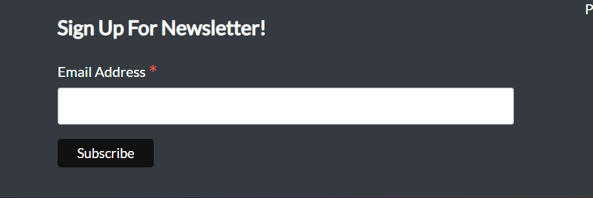
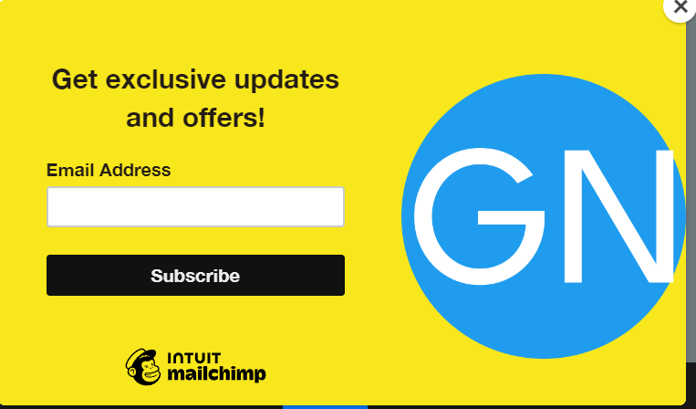

Stay informed about the latest trends, new arrivals, and exclusive offers by subscribing to our newsletter.

- **[Subscribe to Newsletter](https://gn-shop-e18f4dd2529c.herokuapp.com/)**

[Back to Top](#Table-of-Contents)


## SEO Strategy


In our SEO strategy for GN-SHOP, we focused on enhancing the visibility of our e-commerce platform in search engines. We implemented a series of optimizations including keyword selection, meta descriptions, and content integration to improve our search engine rankings.

### Keywords

We conducted thorough research to identify relevant keywords that align with the interests of our target audience and the products we offer. By analyzing competitors' strategies and industry trends, we refined our list to include both short-tail and long-tail keywords.

**Short-tail Keywords**:
- online shopping, buy electronics online, fashion clothing, home essentials, affordable products, latest gadgets, trendy apparel, quality home goods, tech accessories, fashion accessories, discount electronics, best deals online, secure shopping, reliable delivery, easy returns, customer reviews, shop online, GN-SHOP products, top-rated items, popular brands.

**Long-tail Keywords**:
- Discover the latest gadgets and electronics at GN-SHOP, Affordable fashion clothing for men and women at GN-SHOP, Buy quality home essentials at great prices, Find the best deals on tech accessories, Shop trendy apparel online, Secure and easy online shopping experience, Reliable delivery and easy returns on all orders, Read customer reviews on top-rated products, GN-SHOP's selection of popular brands, Your go-to online store for quality products.

### Description

We carefully crafted the meta descriptions for each page, ensuring they are concise yet informative. These descriptions are optimized with our chosen keywords, offering a clear and engaging preview of our content. We regularly update these descriptions to reflect the latest offerings and changes on our site.

### Title

The title tag, located in our website's `base.html` template, is customized for each page to enhance our SEO efforts. This dynamic approach allows us to target specific keywords and improve our search visibility for various search queries.

### Relevant Content

To ensure our content is both search engine optimized and user-friendly, we integrated selected keywords into key elements such as H1 tags, meta data, product names, descriptions, and general text. This integration helps improve our search rankings while providing valuable information to our users.

### Sitemap

We created a comprehensive sitemap for GN-SHOP, allowing search engines like Google to efficiently crawl and index our website's content. This sitemap ensures that all relevant pages are easily discoverable.

- **[sitemap.xml file](https://github.com/wlia-code/ServeShop/blob/main/sitemap.xml)**

### Robots.txt

We configured the `robots.txt` file to manage which pages are accessible to search engines. This file blocks search engines from indexing non-essential pages like login and authentication screens, ensuring that only relevant content is searchable.

- **[robots.txt file](https://github.com/wlia-code/ServeShop/blob/main/robots.txt)** has a link for navigation.

[Back to Top](#Table-of-Contents)


## Visual Overview


### Header
- **Logo and Navigation**: The header prominently features the GN-SHOP logo, linked to the homepage for easy navigation.
  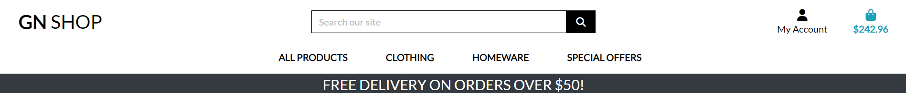
- **Navigation Menu**: Links to product categories, user account, wishlist, and shopping cart, facilitating easy access across the site.
  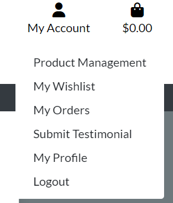

### Home Page
- **Hero Section**: A large, eye-catching slider that highlights current promotions and popular products.
  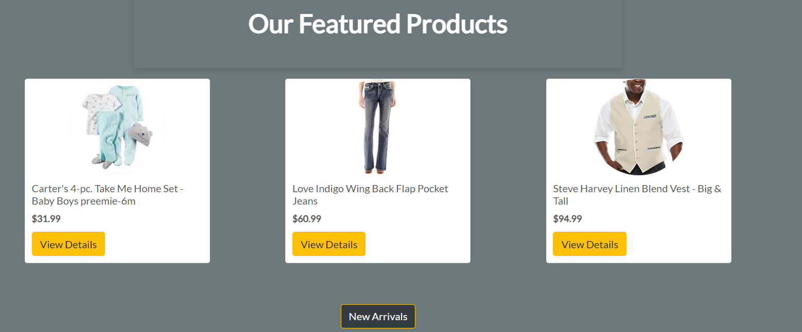
- **Customer Testimonials**: A dedicated section where customers share their experiences and feedback about the products and services offered by GN-SHOP. This feature helps build trust and community engagement by displaying real customer reviews.
  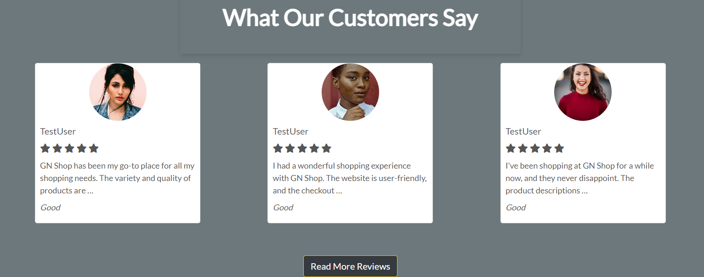

### Product Details
- **Product Information**: Detailed view of products including images, descriptions, prices, and available sizes or colors.
  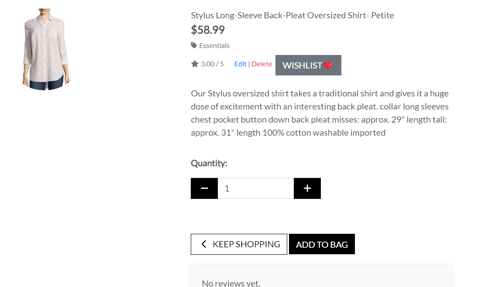
- **Add to Cart**: Button for adding items to the shopping cart.
  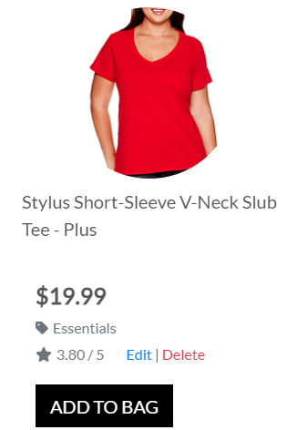

### User Interaction Features
- **Wishlist**: Allows users to save products to their account for later purchase.
  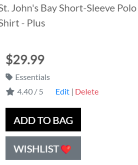
- **Customer Reviews**: Section where customers can leave feedback and rate products.
  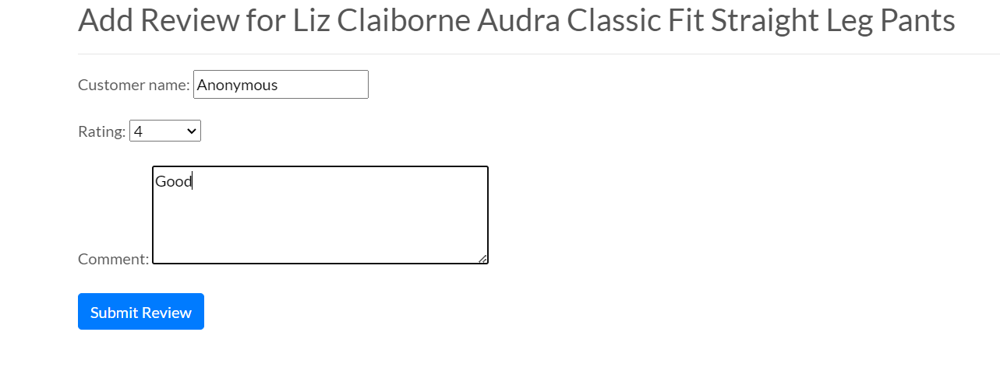

### Footer
- **Footer**
  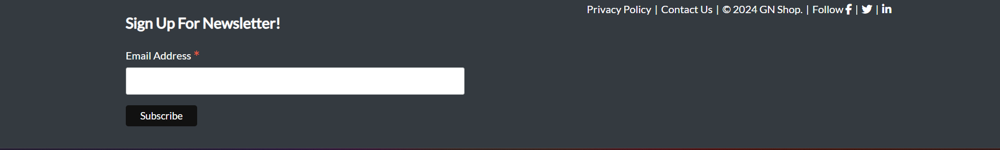
- **Newsletter Subscription**: Users can sign up for newsletters to receive updates and offers.
  
- **Social Media Links**: Quick access links to social media platforms.
  

### Additional Functionalities
- **Contact Us Page**: Contains a form for direct inquiries, enhancing user engagement and support.
  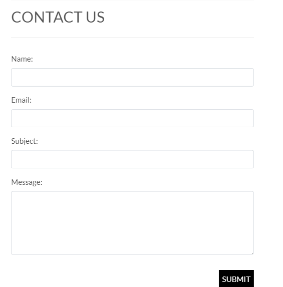
- **Account Management**: Users can manage their profiles, view order history, and update billing and shipping information.
  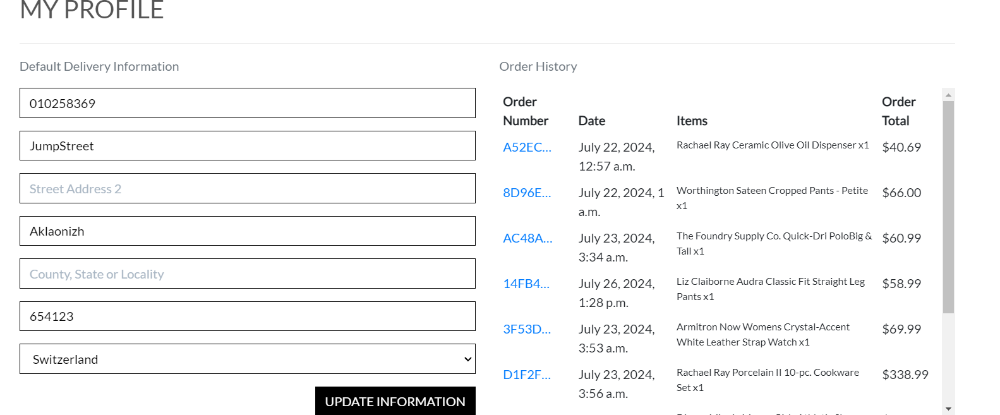

### Checkout and Payment
- **Shopping Cart**: Review of items in the cart with options to update quantities or remove products.
  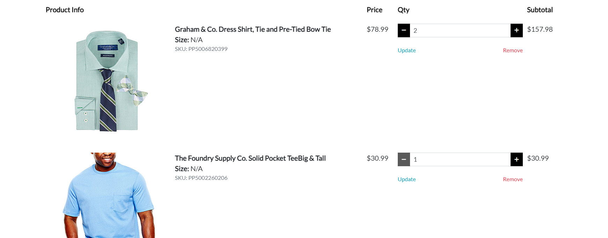
- **Checkout Page**: Secure checkout process with step-by-step guidance to complete purchases.
  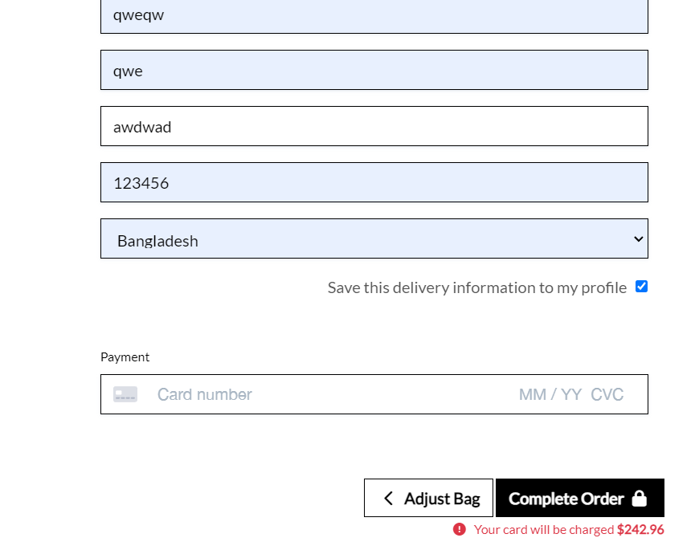

[Back to Top](#Table-of-Contents)


#### Entity Relationship Diagram (ERD)
- **Development**: SQLite3 (default database provided by Django)
- **Production**: PostgreSQL (provided by Heroku)

#### Data Models


**User Model**
- Managed by Django’s built-in User model.
- Attributes include: `username`, `email`, `password`.

**Product Model**
- Represents items available for purchase.
- Attributes include: `name`, `description`, `price`, `image`, `category` (Foreign Key to Category model), `rating` (average rating based on user reviews).

**Category Model**
- Used to categorize products.
- Attributes include: `name`, `description`.

**Order Model**
- Tracks user purchases.
- Attributes include: `order_number` (unique identifier), `user_profile` (Foreign Key to UserProfile, adapted from Code Institute's Boutique Ado), `full_name`, `email`, `phone_number`, `country`, `postcode`, `town_or_city`, `street_address1`, `street_address2`, `county`, `date`, `delivery_cost`, `order_total`, `grand_total`, `original_bag`, `stripe_pid`.

**OrderLineItem Model**
- Represents individual items within an order.
- Linked to the `Order` model by a Foreign Key.
- Attributes include: `order` (Foreign Key to Order), `product` (Foreign Key to Product), `quantity`, `lineitem_total`.

**Wishlist Model**
- Allows users to save products they are interested in.
- Attributes include: `user` (Foreign Key to User), `product` (Foreign Key to Product).

**Testimonial Model**
- Captures customer feedback.
- Attributes include: `user` (Foreign Key to User), `text`, `approved` (Boolean to manage visibility).

**ContactRequest Model**
- Manages queries submitted via the "Contact Us" form.
- Attributes include: `name`, `email`, `subject`, `message`.

[Back to Top](#Table-of-Contents)


## Built With


**Core Technologies:**

* **Django:** A high-level Python web framework that orchestrates our backend logic and infrastructure.
* **Python:** Powers our backend services with its readability and powerful web development capabilities.
* **HTML5:** Structures our web pages ensuring semantic markup and standards compliance.
* **CSS3:** Provides styling to enhance the visual presentation of the website.
* **JavaScript:** Implements interactive and dynamic elements to enhance user engagement.

**Frameworks and Libraries:**

* **Django Allauth:** Manages comprehensive user authentication, including registration, login, and account management, ensuring a secure user experience.
* **Django Crispy Forms:** Utilized to render forms in a way that is bootstrap-friendly and maintains the design consistency throughout the site.
* **Whitenoise:** Efficiently serves static files in production environments, reducing server load and increasing content delivery speed.
* **Bootstrap 4:** Ensures the site is responsive and accessible across all devices with its grid system and pre-styled components.
* **Font Awesome:** Enhances user interface design with a wide array of icons.

**Tools and Services:**

* **AWS S3:** Manages static and media file storage and delivery in production, ensuring scalability and reliability.
* **Heroku:** Provides robust hosting services, simplifying application deployment and management.
* **Git:** Offers version control, facilitating effective tracking of code changes and collaboration.
* **GitHub:** Hosts the project repository, enabling version control and access for collaborators.
* **PostgreSQL:** Delivers powerful database management capabilities in production, suitable for handling complex queries and large volumes of data.
* **Cloudinary:** Manages image storage and manipulation, optimizing performance and user experience.

The integration of these technologies underpins the operational excellence of GN-SHOP, catering to our B2C audience with a seamless e-commerce experience.

[Back to Top](#Table-of-Contents)


## Testing


### Python Tests

#### Checkout Tests

- Tests related to the checkout process can be found under the `checkout` directory:
  - Stripe webhook handling: [test_StripeWH_Handler.py](https://github.com/wlia-code/ServeShop/blob/main/checkout/test_StripeWH_Handler.py)
  - Checkout model tests: [test_models_checkout.py](https://github.com/wlia-code/ServeShop/blob/main/checkout/test_models_checkout.py)
  - Checkout view tests: [test_views_checkout.py](https://github.com/wlia-code/ServeShop/blob/main/checkout/test_views_checkout.py)
  - Checkout webhook tests: [test_webhook.py](https://github.com/wlia-code/ServeShop/blob/main/checkout/test_webhook.py)

#### Home Tests

- Tests for the home page views are located in the `home` directory:
  - Home view tests: [test_views_home.py](https://github.com/wlia-code/ServeShop/blob/main/home/test_views_home.py)

#### Product Tests

- Tests for product functionalities are located in the `products` directory:
  - Product tests: [test_product.py](https://github.com/wlia-code/ServeShop/blob/main/products/test_product.py)

#### Profiles Tests

- Tests for user profile models and views are found in the `profiles` directory:
  - Profile model tests: [test_models.py](https://github.com/wlia-code/ServeShop/blob/main/profiles/test_models.py)
  - Profile view tests: [test_views.py](https://github.com/wlia-code/ServeShop/blob/main/profiles/test_views.py)

### GN-shop was tested on the following browsers:

  - Google Chrome
  - Mozilla Firefox
  - Microsoft Edge
  - Apple Safari

### Validator Testing:

- Accessibility Testing

  - No errors were returned when passing through [WAVE Evaluation Tool](https://wave.webaim.org/)
  - Accessibility test results: 
  - lighthouse testing tool 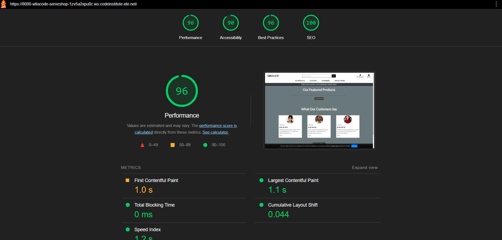

- Codeinstitute Python Linter
  - No errors were returned when passing through codeinstitute Python Linter [CI Python Linter](https://pep8ci.herokuapp.com/)
  - Python Linter results: 

- JAVASCRIPT
  - No errors were returned when passing through the official [jshint](https://jshint.com/)
  - JavaScript validation results: 

- HTML
  - No errors were returned when passing through the official [W3C validator](https://validator.w3.org/nu/#textarea)
  - HTML validation results: 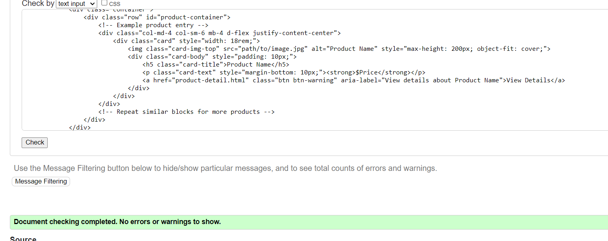

- CSS
  - No errors were found when passing through the official [(Jigsaw) validator](https://jigsaw.w3.org/css-validator/validator)
  - CSS validation results: 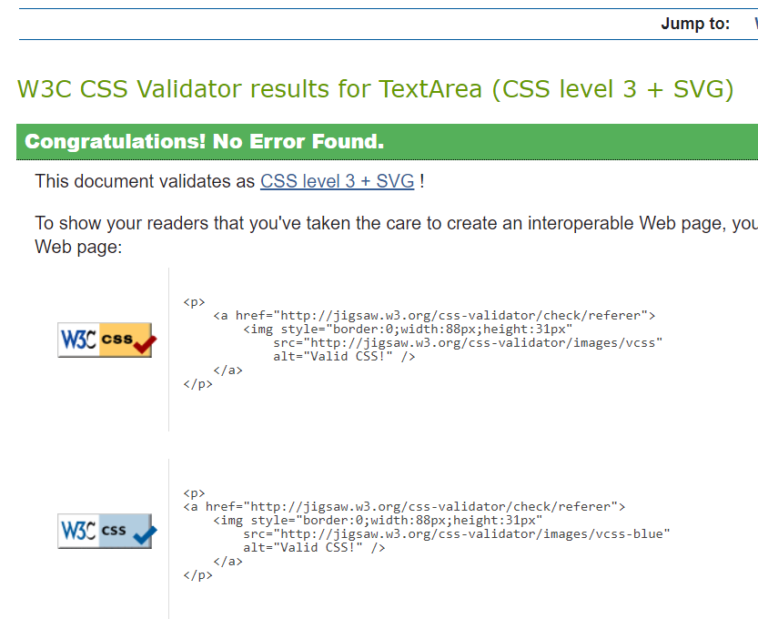

[Back to Top](#Table-of-Contents)


## Bugs Found and Fixed

### Bug Fixes

#### 1. Checkout Process Errors
- **Issue**: Users were experiencing errors during the checkout process.
- **Root Cause**: Stripe API keys were not correctly configured in the production environment.
- **Solution**: Secured and correctly set the Stripe environment variables in Heroku's config vars.
- **Outcome**: The checkout process is now seamless, and transactions are processed without errors.

#### 2. Responsive Design Inconsistencies
- **Issue**: The website was not displaying correctly on various mobile devices.
- **Root Cause**: CSS media queries were not effectively targeting all screen sizes.
- **Solution**: Refactored CSS to enhance responsiveness using Bootstrap's grid system and media queries.
- **Outcome**: Improved user experience across all devices with consistent layout and design.

### Ongoing Monitoring

- **Current Bugs**: Minor styling adjustments are ongoing to ensure compatibility across all browsers.
- **Monitoring**: Regularly reviewing user feedback and system performance to identify and address any new issues as they arise.

### Conclusion

These bug fixes have significantly improved the stability and performance of GN-SHOP. I am committed to maintaining a high standard of quality and responsiveness in managing any future challenges.

[Back to Top](#Table-of-Contents)

## Installation & Usage

### Prerequisites

Ensure that you have Python (version 3.7 or newer) installed on your system. If not, download and install it from [python.org](https://www.python.org/downloads/).

### Installing

### Setup
1. Clone the project repository:
   ```bash
   $ git clone https://github.com/wlia-code/ServeShop

2. Navigate into the project directory:
   ```bash
    $ cd ServeShop

3. Install dependencies:
   ```bash
    $ pip install -r requirements.txt

- Create a env.py file and add the Environment Variables:
  - DATABASE_URL
  - SECRET_KEY
  - STRIPE_PUBLIC_KEY
  - STRIPE_SECRET_KEY
  - STRIPE_WH_SECRET
  - EMAIL_USER
  - EMAIL_PASSWORD
- Create a .gitignore file And add the following files to it:
  - env.py
  - venv

### Running the Application

1. Start the development server
   ```bash
    $ python manage.py runserver

1. Apply database migrations (create tables based on your models)
   ```bash
    $ python manage.py makemigrations
    $ python manage.py migrate

[Back to Top](#Table-of-Contents)

## Deployment

### ElephantSQL

1. Log into [ElephantSQL](https://customer.elephantsql.com/login).
2. Create a new instance by selecting the _Tiny Turtle_ plan and your local region.
3. After creation, from the dashboard, click on the instance name and copy the _Database URL_ for Heroku configuration.

### AWS 3

1. **Log into your AWS Management Console.**
2. **Navigate to the S3 service to create a new bucket.**
- Ensure the bucket is public and enable static website hosting.

**IAM User Configuration**

- In the IAM service, create a new user with programmatic access
- Attach policies directly giving this user access to your S3 bucket.

**Environment Configuration**

- Store your AWS credentials securely and configure them in your Django settings using environment variables.
   - These include `AWS_ACCESS_KEY_ID`, `AWS_SECRET_ACCESS_KEY`, and `AWS_STORAGE_BUCKET_NAME`.

**Django Setup**
- Install `boto3` and `django-storages` packages
- Add `storages` to your `INSTALLED_APPS`
- Set up Django to use S3 for static and media storage with `STATICFILES_STORAGE` and `DEFAULT_FILE_STORAGE`

**Collect Static and Upload**

- Run `python manage.py collectstatic` to upload static files to your S3 bucket

[Back to Top](#Table-of-Contents)

### Heroku

1. Log into [Heroku](https://www.heroku.com/) and create a new app.
2. In the _Settings_ tab, add the following config vars:
   - `CLOUDINARY_URL` (from Cloudinary)
   - `DATABASE_URL` (from ElephantSQL)
   - `SECRET_KEY`
   - `PORT`
   - `EMAIL_PASSWORD` (from your email provider)
3. In the _Resources_ tab, attach the Heroku Postgres service.
4. In the _Deploy_ tab, connect to GitHub, select your repository, and set up automatic deployments from the main branch.
5. Optionally, perform a manual deploy to build the app.

[Back to Top](#Table-of-Contents)

## Credits

### Content

- The icons in the serves page sourced from [Font Awesome](https://fontawesome.com).
- All fonts were sourced from [Google Fonts](https://fonts.google.com).
- Responsive design and components were implemented using [Bootstrap](https://getbootstrap.com).
- User authentication was managed with [Django Allauth](https://django-allauth.readthedocs.io/en/latest/).
- The coding solutions and expert advice sourced from [Stack Overflow](https://stackoverflow.com).

### Media

- Images were sourced from [Unsplash](https://unsplash.com), providing high-resolution photographs for the website.
- Emojis were sourced from [Get Emoji](https://getemoji.com/).

### Github Template

- The project template was provided by the [Code Institute Template](https://github.com/Code-Institute-Org/gitpod-full-template).

### Tools To Build README File

- Website screenshots were captured using the [GoFullPage - Full Page Screen Capture](https://chrome.google.com/webstore/detail/gofullpage-full-page-scre/fdpohaocaechififmbbbbbknoalclacl) extension.
- The README file was crafted using [readme.so](https://readme.so/).

### Development Tools

GN-SHOP was developed using a variety of tools to ensure high-quality development and user experience:

- [GitHub](https://github.com/) for hosting and version control.
- [VS Code](https://code.visualstudio.com/) as the primary code editor.
- [Heroku](https://dashboard.heroku.com/) for application deployment.
- [ElephantSQL](https://www.elephantsql.com/) for database management.
- [Balsamiq](https://balsamiq.com/wireframes/) for wireframe creation.
- [Favicon.io](https://favicon.io/) for favicon generation.
- [Bootstrap5](https://getbootstrap.com/) and [Google Fonts](https://fonts.google.com/) for styling.
- [Code Institute Pylint](https://pep8ci.herokuapp.com/), [W3C HTML Validator](https://validator.w3.org/#validate_by_uri+with_options), and [Jigsaw CSS Validator](https://jigsaw.w3.org/css-validator/#validate_by_uri) for code validation.
- [Chrome Dev Tools](https://developer.chrome.com/docs/devtools/), [W.A.V.E.](https://wave.webaim.org/), and [Chrome LightHouse extension](https://developer.chrome.com/docs/lighthouse/overview/) for testing and optimization.
- [AWS 3](https://signin.aws.amazon.com/signup) for media management.
- [Cloudinary](https://cloudinary.com/) for media management.
- [FACEBOOK](https://www.facebook.com/) for WEB MARKETING.

These tools collectively enhance the efficiency, reliability, and scalability of the GN-Shop project.

[Back to Top](#Table-of-Contents)

## Acknowledgements

I would like to express my gratitude to several key individuals who have supported me throughout the development of GN-SHOP.

### Mentorship
- **Victor Miclovich**: thanks to Victor for his invaluable guidance and mentorship for pp4 .
- **David Bowers**: thanks to David for his invaluable guidance and mentorship for pp1 and pp2 and pp3.
### Support
- **Code Institute Student Care**: A special thank you to the Student Care team at [Code Institute](https://codeinstitute.net).

[Back to Top](#Table-of-Contents)
