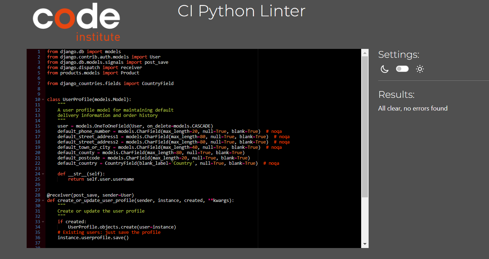

# GN-SHOP Documentation

## Table of Contents

1. [Testing](#testing)
   - [Python Unittest](#python-unittest)
   - [Manual Testing](#manual-testing)
2. [Validators](#validators)
3. [Screenshots for Validation](#screenshots-for-validation)
4. [Bugs Found and Fixed](#bugs-found-and-fixed)
5. [Notes on Code Quality](#notes-on-code-quality)
6. [Conclusion](#conclusion)
7. [README](readme.md)

---

## Testing

### Python Unittest

#### Checkout Tests

- Tests related to the checkout process can be found under the `checkout` directory:
  - Stripe webhook handling: [test_StripeWH_Handler.py](https://github.com/wlia-code/ServeShop/blob/main/checkout/test_StripeWH_Handler.py)
  - Checkout model tests: [test_models_checkout.py](https://github.com/wlia-code/ServeShop/blob/main/checkout/test_models_checkout.py)
  - Checkout view tests: [test_views_checkout.py](https://github.com/wlia-code/ServeShop/blob/main/checkout/test_views_checkout.py)
  - Checkout webhook tests: [test_webhook.py](https://github.com/wlia-code/ServeShop/blob/main/checkout/test_webhook.py)

#### Home Tests

- Tests for the home page views are located in the `home` directory:
  - Home view tests: [test_views_home.py](https://github.com/wlia-code/ServeShop/blob/main/home/test_views_home.py)

#### Product Tests

- Tests for product functionalities are located in the `products` directory:
  - Product tests: [test_product.py](https://github.com/wlia-code/ServeShop/blob/main/products/test_product.py)

#### Profiles Tests

- Tests for user profile models and views are found in the `profiles` directory:
  - Profile model tests: [test_models.py](https://github.com/wlia-code/ServeShop/blob/main/profiles/test_models.py)
  - Profile view tests: [test_views.py](https://github.com/wlia-code/ServeShop/blob/main/profiles/test_views.py)

### Manual Testing

This section of the documentation outlines various manual tests and online validations conducted to ensure the quality and functionality of the GN-SHOP project.

#### Stripe Testing

To test the checkout payments with card details in test mode, I used the following card number:

- **4242424242424242**: Successful Visa card payment in test mode.

The test was successfully performed, confirming that the Stripe integration is working as expected.

---

#### Home/Index

| Test                | Method                                    | Expected Outcome                                      | Result |
|---------------------|-------------------------------------------|-------------------------------------------------------|--------|
| Logo/Home Link      | Click on the logo at the top of the page   | Redirects to the home page                            | PASS   |
| All Products Link   | Click on "All Products" nav link           | Opens the All Products Page                           | PASS   |
| Clothing Link       | Click on "Clothing" nav link               | Opens the Clothing category page                      | PASS   |
| Homeware Link       | Click on "Homeware" nav link               | Opens the Homeware category page                      | PASS   |
| Special Offers Link | Click on "Special Offers" nav link         | Opens the Special Offers page                         | PASS   |
| Collections Click   | Click on the "Collections" dropdown        | Opens a dropdown with links to various collections     | PASS   |
| My Account Icon     | Click on the My Account icon               | Opens a dropdown with account-related links           | PASS   |
| Shopping Bag Icon   | Click on the Shopping Bag icon             | Opens the Shopping Bag page                           | PASS   |
| Shop Now Button     | Click on the "Shop Now" button             | Opens the All Products Page                           | PASS   |
| Read More Reviews   | Click on the "Read More Reviews" button    | Opens the Reviews page                                | PASS   |
| New Arrivals        | Click on "New Arrivals" link               | Opens the New Arrivals page                           | PASS   |

#### Featured Collection Section

| Test              | Method                                              | Expected Outcome                                 | Result |
|-------------------|-----------------------------------------------------|--------------------------------------------------|--------|
| See More Button   | Click on the "See More" button in Featured Collection section | Redirects to the specific collection page | PASS   |

#### Contact Section

| Test                | Method                               | Expected Outcome                                     | Result |
|---------------------|--------------------------------------|------------------------------------------------------|--------|
| Send Message Button | Click on the "Send Message" button in Contact section | Redirects to the Contact page                        | PASS   |

#### Footer

| Test                | Method                  | Expected Outcome                                     | Result |
|---------------------|-------------------------|------------------------------------------------------|--------|
| Media Links         | Click on media links    | Opens the respective social media page in a new tab   | PASS   |

#### Contact

| Test                | Method                                    | Expected Outcome                                      | Result |
|---------------------|-------------------------------------------|-------------------------------------------------------|--------|
| Submit Form         | Attempt to submit a blank form             | Form validation prevents submission; alerts the user  | PASS   |
| Submit Form         | Attempt to submit with one input filled    | Form validation prevents submission; alerts the user  | PASS   |
| Email Input         | Enter an invalid email address             | Form will not send; user is prompted for a valid email | PASS   |
| Submit Valid Form   | Submit a complete and valid form           | Page reloads; displays a success message               | PASS   |
| Admin Panel         | Check submission in the Admin Panel        | Information stored correctly in the database           | PASS   |

#### Profile

| Test                | Method                        | Expected Outcome                                      | Result |
|---------------------|-------------------------------|-------------------------------------------------------|--------|
| Profile Link        | Attempt access while logged out | Profile page is not accessible to users not logged in  | PASS   |
| Profile Link        | Click when logged in           | Redirects user to their profile page                   | PASS   |
| Update Button       | Click "Update" button          | The profile is updated and saved                       | PASS   |
| Input Fields        | Enter invalid inputs           | User receives an error message                         | PASS   |
| Input Fields        | Enter valid inputs             | User is informed that the profile was saved successfully | PASS   |

#### Authentication

| Test                | Method                                    | Expected Outcome                                      | Result |
|---------------------|-------------------------------------------|-------------------------------------------------------|--------|
| Sign Up             | Create an account                          | Prompted to wait for admin email confirmation          | PASS   |
| Login               | Login with a registered account            | Redirected to homepage with a login success message    | PASS   |
| Remember Me         | Click "Remember Me" before logging in       | User stays logged in on the next visit                 | PASS   |
| Forgot Password     | Submit email via "Forgot Password" form     | Password reset link sent to the user's email           | PASS   |

#### Basket and Bag

| Test                    | Method                                    | Expected Outcome                                      | Result |
|-------------------------|-------------------------------------------|-------------------------------------------------------|--------|
| Basket Icon             | Click on Basket icon in the navigation bar | Redirects to the Bag page                              | PASS   |
| Basket Page with No Items| Open basket page without items            | Displays a message indicating an empty basket          | PASS   |
| Item in Basket          | Add an item to the basket                  | Item appears in the basket                             | PASS   |
| Multiple Items in Basket| Add multiple items                         | All items and quantities are updated correctly         | PASS   |
| Delete Item in Basket   | Click 'Delete' button                      | Item is removed from the basket                        | PASS   |
| Update Item in Basket   | Click 'Update' button                      | Item quantity is updated in the basket                 | PASS   |
| Summary Total Calculator| Change item quantities                     | Total price updates accordingly                        | PASS   |
| Checkout Button         | Click on the checkout button               | Redirects to the Stripe checkout page                  | PASS   |
| Checkout Validation     | Incomplete checkout submission             | Checkout does not proceed until all fields are filled  | PASS   |
| Checkout Success        | Complete checkout successfully             | Redirects to success page with payment confirmation    | PASS   |
| Checkout Fail           | Attempt failed checkout                    | Remains on the same page with an error message         | PASS   |
| Order History Update    | Complete checkout and check history        | Order appears in order history                         | PASS   |

#### Management

| Test                    | Method                            | Expected Outcome                                      | Result |
|-------------------------|-----------------------------------|-------------------------------------------------------|--------|
| Management Link         | Access management as admin        | Management link is visible and functional              | PASS   |
| Submit Form             | Add a new product via form        | Product is added; confirmation message displayed       | PASS   |
| Image Upload to AWS     | Submit form with image            | Image is stored and displayed correctly via AWS        | PASS   |
| Superuser Access Only   | Attempt non-admin access          | Receives "not allowed" message                         | PASS   |
| Product List            | Verify new product appears        | New product is visible with correct details            | PASS   |
| Form Validation         | Submit invalid form data          | Submission is prevented; error messages displayed      | PASS   |

#### Product Cards

| Test                    | Method                          | Expected Outcome                                      | Result |
|-------------------------|---------------------------------|-------------------------------------------------------|--------|
| Edit and Delete Buttons | Superuser views product page    | Edit and delete buttons are visible                    | PASS   |
| Edit Button             | Click on the edit button        | Redirects to product edit page with a success message  | PASS   |
| Delete Button           | Click on the delete button      | Product is removed after confirmation                  | PASS   |
| Wishlist                | Click on wishlist button        | Product is added to wishlist with success message      | PASS   |
| Product Card Image      | Click on product image          | Redirects to product detail page                       | PASS   |

#### Product Detail

| Test                    | Method                          | Expected Outcome                                      | Result |
|-------------------------|---------------------------------|-------------------------------------------------------|--------|
| Edit and Delete Buttons | Superuser views product detail  | Edit and delete buttons are visible                    | PASS   |
| Edit Button             | Click on the edit button        | Redirects to product edit page with a success message  | PASS   |
| Delete Button           | Click on the delete button      | Product is removed after confirmation                  | PASS   |
| Wishlist                | Click on wishlist button        | Product is added to wishlist with success message      | PASS   |
| Quantity Adjustment     | Click on + or - buttons         | Quantity increases or decreases correctly              | PASS   |
| Keep Shopping Button    | Click on Keep Shopping button   | Redirects to the products page                         | PASS   |
| Add to Bag Button       | Click on Add to Bag button      | Product is added to bag with success message           | PASS   |
| Add Review              | Submit a review                 | Review is added and displayed                          | PASS   |
| Edit Review Button      | Click on edit review button     | Redirects to review edit page                          | PASS   |
| Delete Review Button    | Click on delete review button   | Review is removed                                      | PASS   |
| Edit Review Page        | Submit edited review            | Redirects to product detail page with success message  | PASS   |

#### Wishlist 

| Test                    | Method                          | Expected Outcome                                      | Result |
|-------------------------|---------------------------------|-------------------------------------------------------|--------|
| Wishlist Page           | View products on wishlist       | Products are listed correctly on the wishlist page     | PASS   |
| Trash Icon Button       | Click on Trash Icon Button      | Product is removed from the wishlist                  | PASS   |
| Card Image              | Click on Image                  | Redirects to the product detail page                   | PASS   |

---

## Validators

To ensure code quality and proper formatting, the following validators were used:

- **HTML**: [W3C HTML Validator](https://validator.w3.org/)
- **CSS**: [W3C CSS Validator](https://jigsaw.w3.org/css-validator/)
- **JavaScript**: [JSHint](https://jshint.com/)
- **Python**: [PEP8 Online](http://pep8online.com/)

### Validation Results for Python Files

| File Name          | Validator Result | Notes                                                        |
|--------------------|------------------|--------------------------------------------------------------|
| `manage.py`        | PASS             |                                                              |
| `settings.py`      | PASS             | `# noqa` used to skip line length warnings in some lines.   |
| `urls.py`          | PASS             |                                                              |
| `views.py`         | PASS             |                                                              |
| `models.py`        | PASS             |                                                              |
| `forms.py`         | PASS             |                                                              |
| `admin.py`         | PASS             |                                                              |
| Other Python files | PASS             |                                                              |

### Accessibility Testing

- No errors were returned when passing through [WAVE Evaluation Tool](https://wave.webaim.org/)
- Accessibility test results: 
- Lighthouse testing tool: 

### Codeinstitute Python Linter

- No errors were returned when passing through codeinstitute Python Linter [CI Python Linter](https://pep8ci.herokuapp.com/)
- Python Linter results: 

### JavaScript

- No errors were returned when passing through the official [JSHint](https://jshint.com/)
- JavaScript validation results: 

### HTML

- No errors were returned when passing through the official [W3C validator](https://validator.w3.org/nu/#textarea)
- HTML validation results: 

### CSS

- No errors were found when passing through the official [(Jigsaw) validator](https://jigsaw.w3.org/css-validator/validator)
- CSS validation results: 

[Back to Top](#table-of-contents)

## Screenshots for Validation

Screenshots were taken to validate and provide visual confirmation of the results mentioned in this document. The screenshots are stored in the project's "media/readme_media/testing" directory.

### Screenshots List:

1. **Python PEP8 Validation**

   **bag-views**  
   

   **checkout-forms**  
   

   **checkout-models**  
   

   **checkout-webhooks**  
   

   **home-forms**  
   

   **profiles-views**  
   

   **profiles-forms**  
   

   **profile-models**  
   

   **products-views**  
   

   **products-models**  
   

   **products-forms**  
   

2. **HTML Validator Screenshots**

   **mobile header Html**  
   

   **Base HTML**  
   

   **Checkout HTML**  
   

   **Home HTML**  
   

   **Products HTML**  
   

   **Profiles HTML**  
   

   **Product Details HTML**  
   

3. **Responsive Design Tests**

   **Desktop View**  
   

   **Desktop Responsive View**  
   

   **iPad View**  
   

   **iPhone View**  
   

   **Responsive All Views**  
   

## Bugs Found and Fixed

### Bug Fixes

#### 1. Checkout Process Errors
- **Issue**: Users were experiencing errors during the checkout process.
- **Root Cause**: Stripe API keys were not correctly configured in the production environment.
- **Solution**: Secured and correctly set the Stripe environment variables in Heroku's config vars.
- **Outcome**: The checkout process is now seamless, and transactions are processed without errors.

#### 2. Responsive Design Inconsistencies
- **Issue**: The website was not displaying correctly on various mobile devices.
- **Root Cause**: CSS media queries were not effectively targeting all screen sizes.
- **Solution**: Refactored CSS to enhance responsiveness using Bootstrap's grid system and media queries.
- **Outcome**: Improved user experience across all devices with consistent layout and design.

### Ongoing Monitoring

- **Current Bugs**: Minor styling adjustments are ongoing to ensure compatibility across all browsers.
- **Monitoring**: Regularly reviewing user feedback and system performance to identify and address any new issues as they arise.

## Conclusion

These bug fixes have significantly improved the stability and performance of GN-SHOP. I am committed to maintaining a high standard of quality and responsiveness in managing any future challenges.

[Back to Top](#table-of-contents)

## Notes on Code Quality

Some Python files contain lines that are longer than the PEP8 recommended line length. In such cases, `# noqa` comments have been added to the end of those lines to suppress the warnings for line length, ensuring a balance between code readability and functionality without compromising on coding standards.

---

By following the outlined testing processes and validations, the GN-SHOP project is confirmed to be functionally robust, visually consistent across devices, and coded in accordance with industry best practices.
